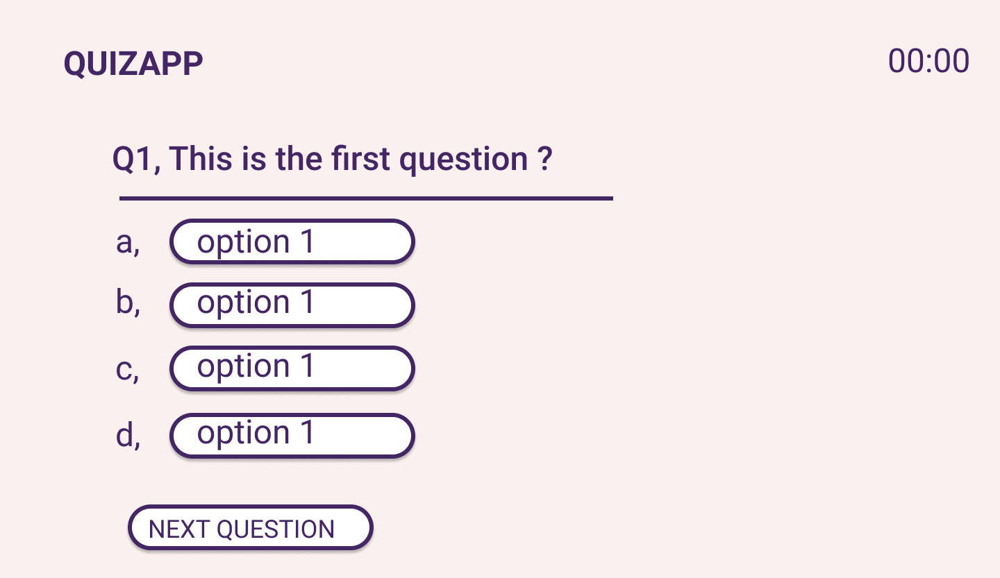
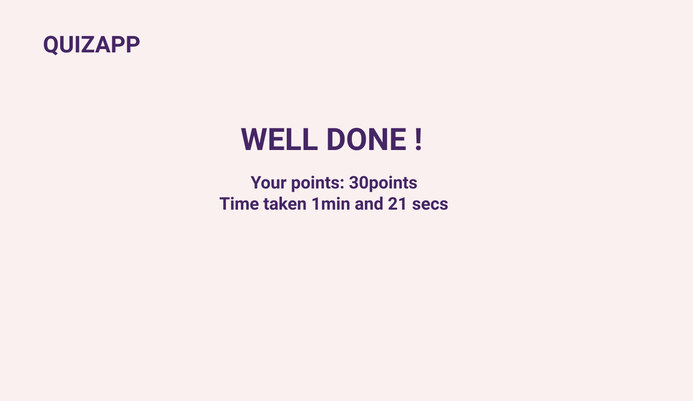

By Freshta Bashari
## quizApp
quizApp is a collection of 21 questions, each question has 10 points. There is a timer to show the time that the user took to answer the questions. On quizApp a user can start to take the quiz, choose the best answer for each quistion and at the end the user can see how many points they did collect in how many minutes and seconds.

## Technologies Used
- JavaScript
- HTML
- CSS
- Figma for wireframes

## User Stories
- User can start the quiz
- User choose the answer
- User select the next question button
- User can see points and time

## Wireframes
The start page :

The quiz page :

The quiz page (when the user select a question):

The end page :

